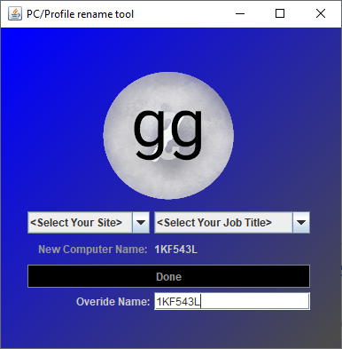

# JSrenamer
I created this tool and packaged it with a windows 10 roll out image. This way when users logged in for the first time the could pick there location from a list and the service tag would automatically be added to the name. Also if a custom name is needed pressing the Ctrl key while first drop down is selected will give you access to custom naming. 

